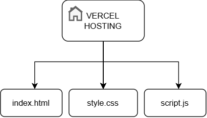
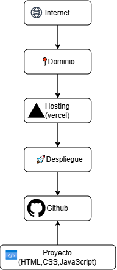

# floristeria_vicky_web
trabajo practico de desarrollo web

🏠 *Hosting* = la casa donde está nuestra página osea el lugar donde vive nuestra página web en Internet.

📍 *Dominio* = la dirección de esa casa osea  es el nombre o dirección que utilizamos para acceder a un sitio web.
ejemplo: (estos son pagos ya que son unicos)

* google.com

* youtube.com

*En nuestro caso* :   .vercel.app

*Despliegue*: tomamos nuestro proyecto y lo  ponemos disponible en un servidor para que pueda ser utilizado desde Internet.

-1.png>)

"El despliegue es el proceso mediante el cual pasamos nuestro proyecto desde el entorno de desarrollo hasta un servidor donde puede ser accesible públicamente."

EXPLICACION GENERAL:

* El dominio indica dónde encontrar la página.

* El hosting es dónde están alojados los archivos.

* El despliegue es el proceso de llevar esos archivos al hosting.